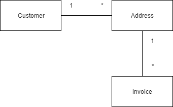

# acme

## How to run
run server: mvn clean spring-boot:run
******
run tests: mvn test

## Description
This applications runs on spring boot and uses H2 in-memory database.
Here's the data model I use:

The disadvantage of this approach is that you have to look up customer by foreign key in address table which is not so convenient. 
If I'd associate invoice with customer I should've done the same thing for address. So I've chosen that model because to me it seemed natural: Invoice is associated with address, not with customer.

I intentionally haven't implement 'real' database support (it only uses in-memory H2 database) for the sake of simplicity.

###example requests:
#### get invoices per month
GET http://localhost:8080/api/v1.0/invoices?customerId=22&month=2017-06

[ {
  "id" : 36,
  "invoiceType" : "advancePayment",
  "amount" : 99.9,
  "month" : "2017-06",
  "address" : 15
}, {
  "id" : 37,
  "invoiceType" : "shopPurchase",
  "amount" : 99.9,
  "month" : "2017-06",
  "address" : 15
} ]

#### get shop invoices
GET http://localhost:8080/api/v1.0/invoices?customerId=22&filter=shopPurchase&month=2017-06

[ {
  "id" : 37,
  "invoiceType" : "shopPurchase",
  "amount" : 99.9,
  "month" : "2017-06",
  "address" : 15
} ]

#### get invoices per address
GET http://localhost:8080/api/v1.0/invoices?customerId=22&addressId=14

[ {
  "id" : 34,
  "invoiceType" : "shopPurchase",
  "amount" : 99.9,
  "month" : "2017-04",
  "address" : 14
}, {
  "id" : 35,
  "invoiceType" : "shopPurchase",
  "amount" : 99.9,
  "month" : "2017-05",
  "address" : 14
} ]

#### get full invoices history
GET http://localhost:8080/api/v1.0/invoices?customerId=21

[ {
  "id" : 31,
  "invoiceType" : "advancePayment",
  "amount" : 20.99,
  "month" : "2017-01",
  "address" : 11
}, {
  "id" : 32,
  "invoiceType" : "advancePayment",
  "amount" : 14.95,
  "month" : "2017-02",
  "address" : 12
}, {
  "id" : 33,
  "invoiceType" : "shopPurchase",
  "amount" : 99.9,
  "month" : "2017-03",
  "address" : 13
} ]

#### generate invoice:
POST http://localhost/sysapi/v1.0/invoices
Content-Type: application/json
{
  "invoiceType" : "shopPurchase",
  "amount" : 79.9,
  "address" : 15,
  "month" : "2017-06"
}

response:

201 CREATED
{
  "id": 313,
  "invoiceType": "shopPurchase",
  "amount": 79.9,
  "month": "2017-06",
  "address": 15
}

